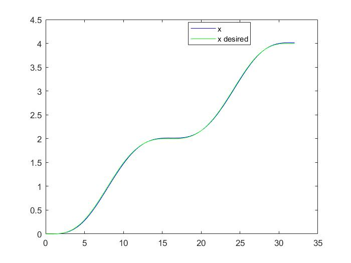
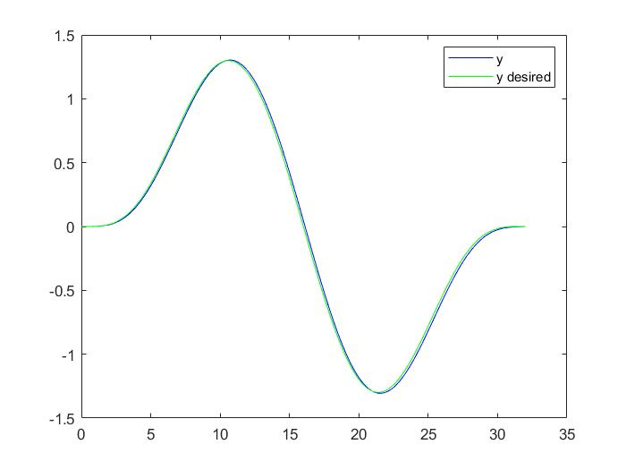
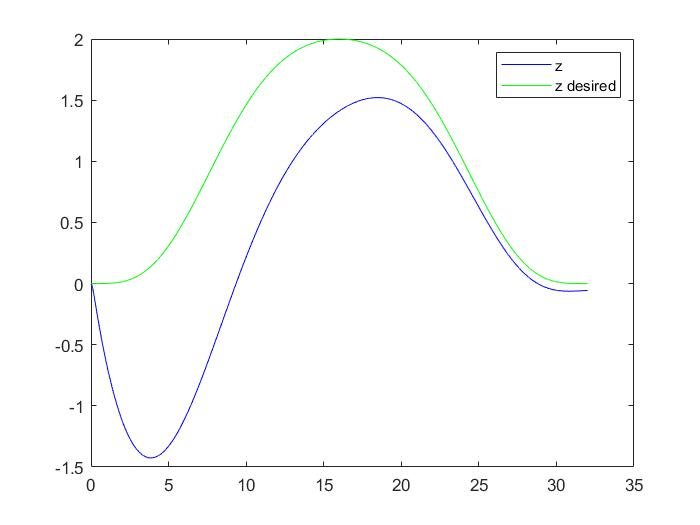
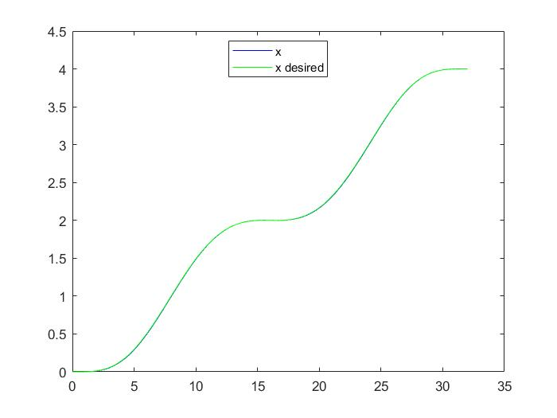
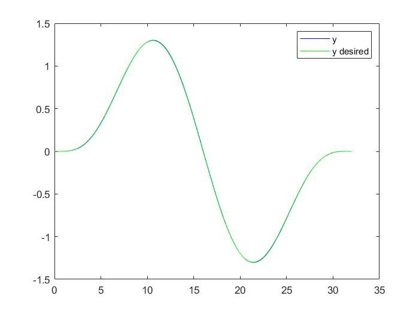
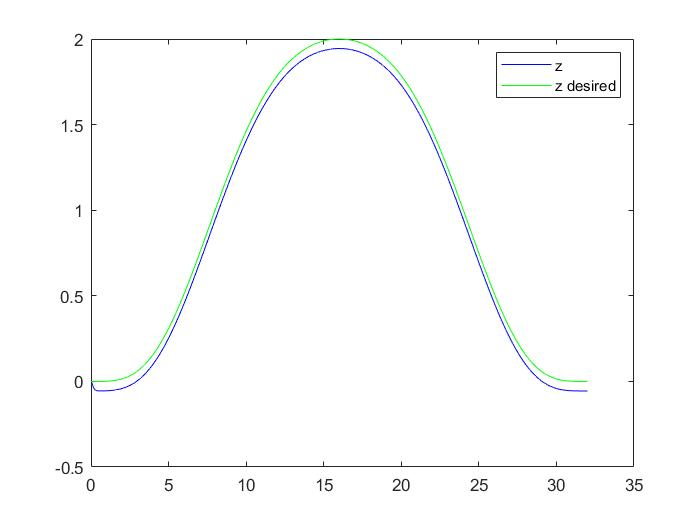
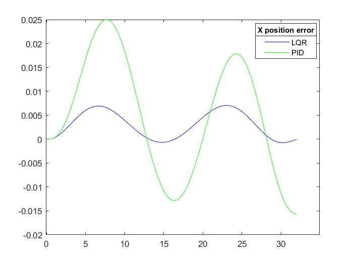
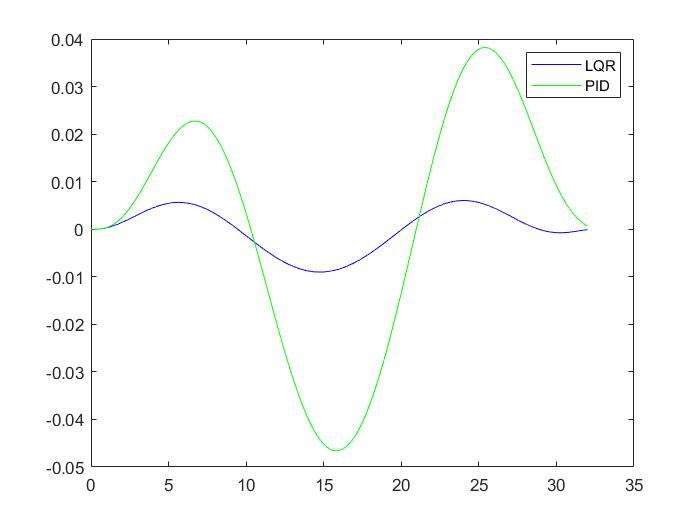
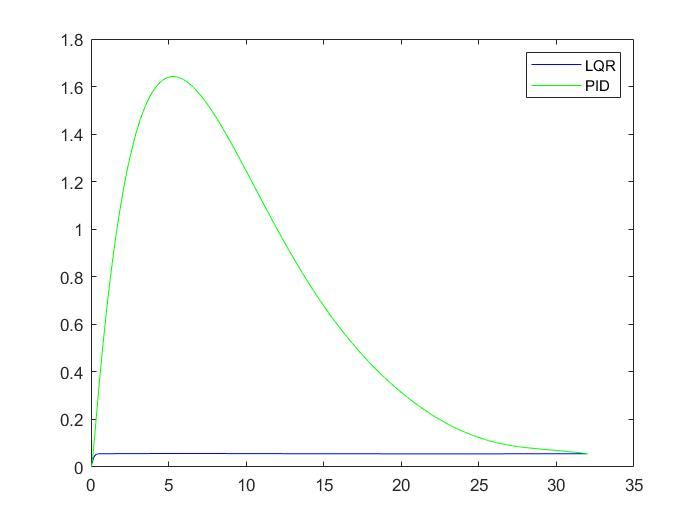

# Quadcopter_Control

## Introduction
  In this project,we will learn the dynamics of the Quadcopter and implement control algorithms on it.

## Altitude control of a 1D Quadcopter
### Hover at height 1 m

## 2D trajectory tracking using PID controller
Goal was to track the given two dimensional trajectories while minimising the position error.
### Line Trajectory

### Sine Trajectory

### Diamond Trajectory

## 3D trajectory tracking using PID controller
Goal was to track the given three dimensional trajectories while minimising the position error.
### Helix Trajectory

### Minimum Snap Trajectory through given waypoints

## Graphs
### Minimum Snap Trajectory following using PID
 | 
--------------------------------------------------------|-----------------------
  | 

### Minimum Snap Trajectory following using LQR
 | 
--------------------------------------------------------|-----------------------
  | 

### Comparison of Trajectory tracking error (LQR vs PID)
 | 
--------------------------------------------------------|-----------------------
  | 

## Simulink modelling of the Quadcopter
  * Dynamics Study of the Quadcopter according to the paper [Modelling and Stabilizing Control laws design based on Backstepping for an UAV type Quadrotor](https://drive.google.com/file/d/1x7zfYDEAd4OGHKVt8xIQ0uwxMXA-TSl7/view?usp=sharing)
  * Linearized the equations around hovering point.
  * Developed the simulink model of Quadcopter.[[Simulink Model](https://github.com/Ayush1285/Robust_Quadcopter_Control/blob/main/Simulink%20Models/Quadrotor_linearized.slx)]
  
## PID on the Quadcopter model
  Our goal was to implement PID and LQR controller on the Simulink model of Quadcopter and compare them
  
  **Minimum Snap trajectory following(Desired Path: Yellow, Obtained Output: Blue)**
  
  
## Linear Quadratic Regulator(LQR) on the Quadcopter

  **Minimum Snap trajectory following(Desired Path: Yellow, Obtained Output: Blue)**
  
  
## Comparison of PID and LQR control system on the Quadcopter
  Here, we will compare error during the trajectory tracking
  
  **Error Plots(LQR: Yellow, PID: Blue)**
  
  
